# KOSMOS IHM

> Desktop post-processing workstation for KOSMOS underwater camera deployments.  
> Qualify, annotate, and export marine observation data from raw MP4 footage.

  

---

## About

KOSMOS IHM (*Interface Homme-Machine*) is the companion desktop application for the **KOSMOS system** — an autonomous underwater video recorder developed at IMT Atlantique. After a field deployment, operators bring back a folder of raw MP4 files and run them through this workstation to qualify recordings, annotate biological events, fill in metadata, and extract deliverables.

All campaign data is persisted as per-video `_temp.json` sidecar files. The original raw JSON files produced by the device are **never modified**.

---

## Screenshots

### Home
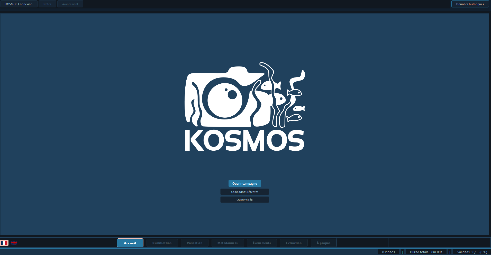

The home page lets you open an existing campaign or create a new one by selecting the raw footage folder, the campaign output directory, and the working directory. Recent campaigns are accessible in one click, and a quick single-video mode is available for ad-hoc review.

---

### Qualification
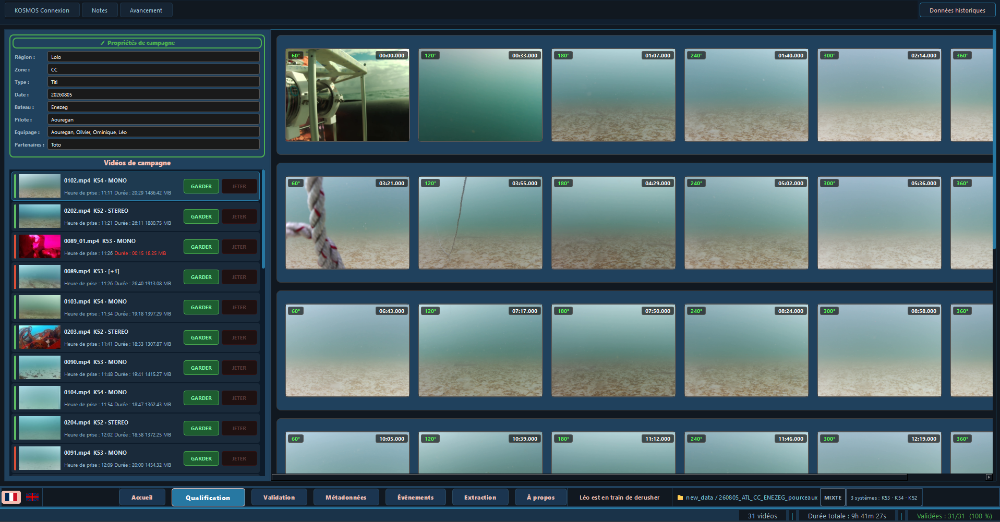

The qualification page is the first processing step. All videos of the campaign are displayed in the left panel with their name, duration and file size. The operator watches each video through the embedded player and decides to **Keep** (Garder) or **Discard** (Jeter) it. The right panel shows the motor rotations for the selected video. Discarded videos are moved to a trash bin and can be restored at any time. `Ctrl+Z` undoes the last keep/discard action.

---

### Validation
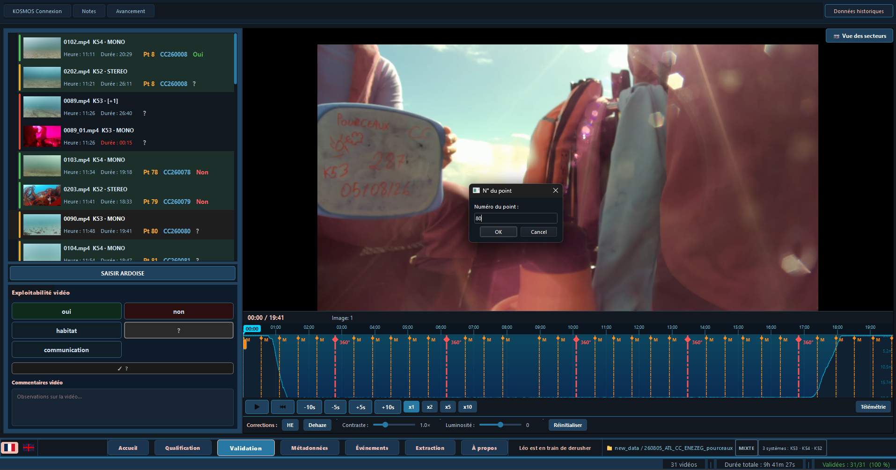

The validation page is a secondary review pass over the qualified videos. For each video the operator can set its **exploitability** status (exploitable / partially exploitable / not exploitable) and confirm the stereo/mono camera configuration. Filling in the **slate** (ardoise) is mandatory on this page before the video can be considered validated. All choices are persisted in the per-video `_temp.json` sidecar file. `Ctrl+Z` undoes the last exploitability change.

---

### Event annotation
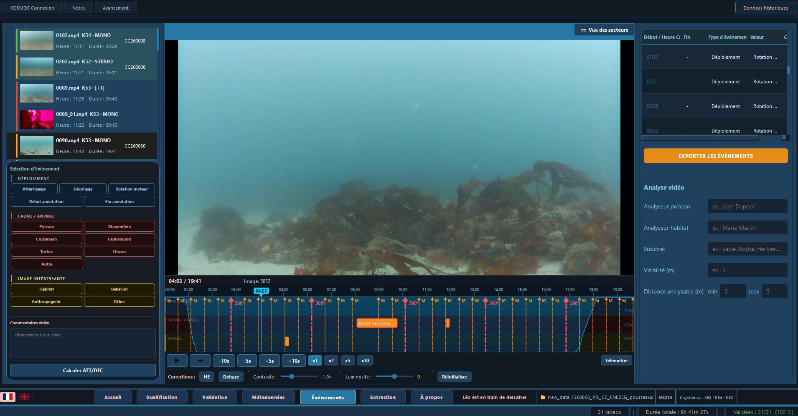

The event annotation page allows the operator to stamp timestamped biological observations directly on the video timeline. Supported event types include fish, birds, turtles and motor events, each with a configurable sub-type, count and free-text comment. A sound cue plays on each capture. Events are displayed in a tree view on the right and can be moved along the timeline with `Ctrl+drag`. `Ctrl+Z` undoes the last placement, deletion or move. The full event list can be exported to CSV.

### Event export
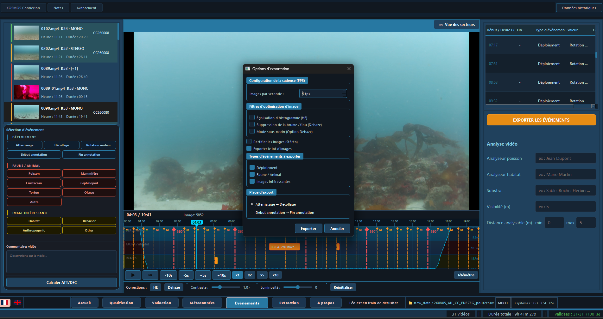

The event export dialog lets the operator export the annotated events for one or all videos of the campaign. The output is a CSV file containing the timecodes, event types, values and comments, ready to be imported into analysis tools.

---

### Metadata editing
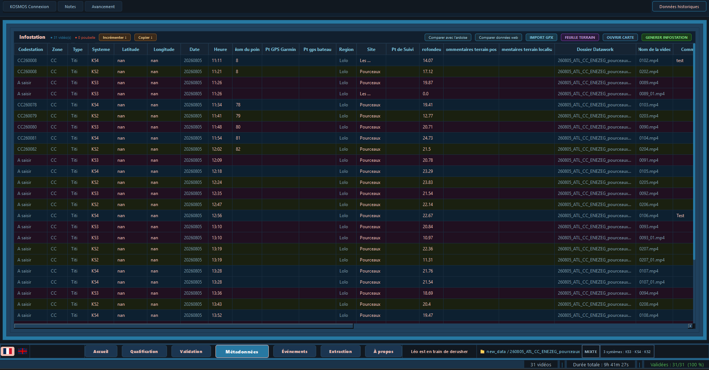

The metadata page exposes all structured observation fields defined in `template.json`: zone, date, boat name, pilot, GPS coordinates, depth, visibility, sea state, and more. Campaign-level fields (zone, date, crew) are read-only and shared across all videos; video-level fields are editable per video. A weather lookup button fetches current conditions from Open-Meteo and pre-fills the relevant fields. A GPS map view lets the operator verify or correct the deployment position.

---

### Extraction
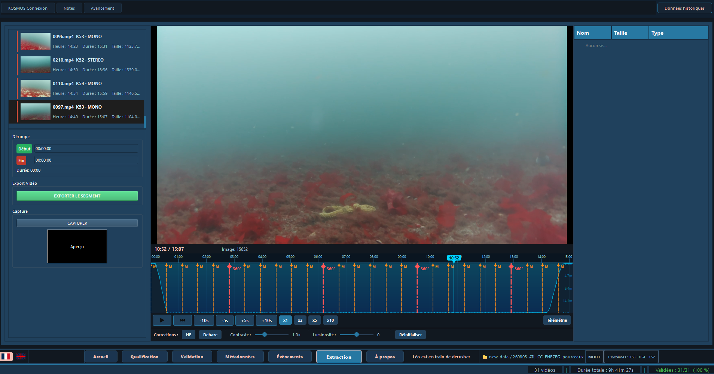

The extraction page is used to produce deliverables from each video. The operator sets in/out markers on the timeline to clip a segment, or captures individual still frames. Several image enhancement options are available: histogram equalisation, CLAHE dehazing, underwater colour correction, and stereo rectification for dual-camera footage. All extracted segments and frames are listed in a deliverables tree with thumbnails and can be re-exported at any time.

---

### SFTP transfer
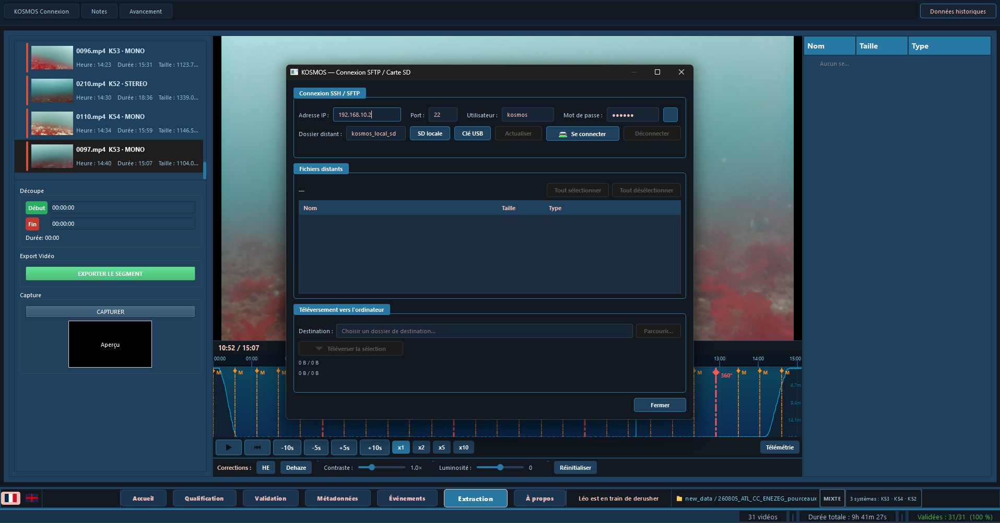

The SFTP dialog connects directly to the KOSMOS device over SSH/SFTP (via paramiko) without needing to mount the SD card. The operator enters the device's IP address and credentials, browses the remote file system, and transfers the raw footage and JSON telemetry files to the local campaign folder in one operation.

---

### Telemetry
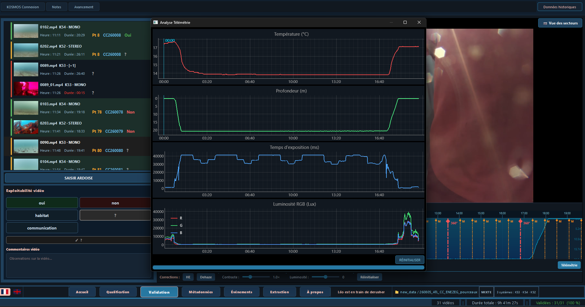

The telemetry dialog displays the raw sensor data recorded by the KOSMOS device during a deployment. It reads the CSV telemetry file associated with the current video and presents the time-series data (motor rotations, depth, heading, etc.) so the operator can cross-check the deployment conditions alongside the video footage.

---

### Deployment planner
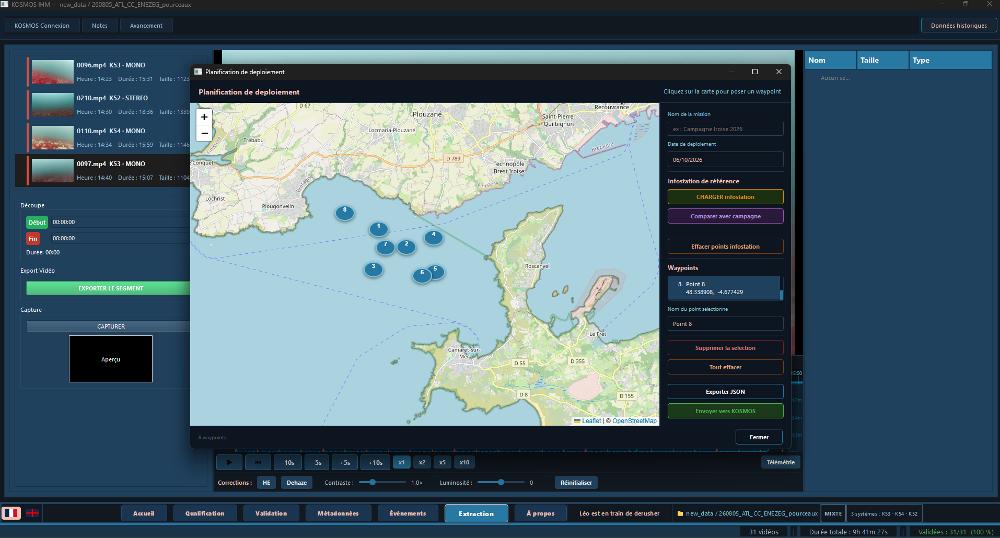

The deployment planner is an interactive Leaflet map (embedded via Qt WebEngine) that lets the team plan the spatial coverage of a mission before heading to the field. Deployment points can be placed, moved and annotated directly on the map. The planned stations can be exported as a waypoint list.

---

### Historical data
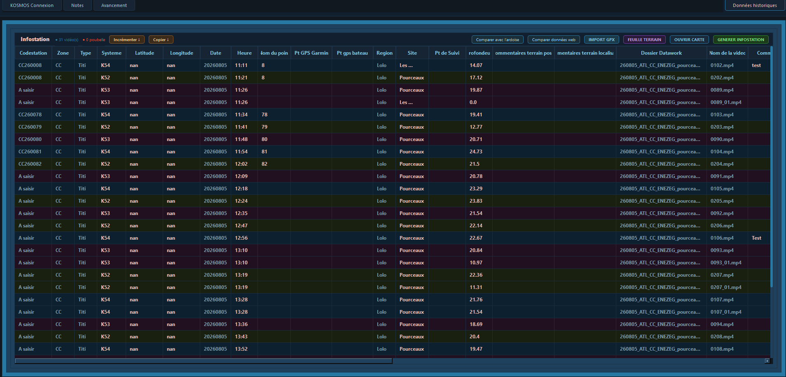

The historical data dialog allows the operator to load and browse observation records from previous campaigns. This makes it possible to cross-reference past deployments at the same site, compare event counts over time, and avoid duplicating annotations already recorded in earlier missions.

---

### Progress dashboard
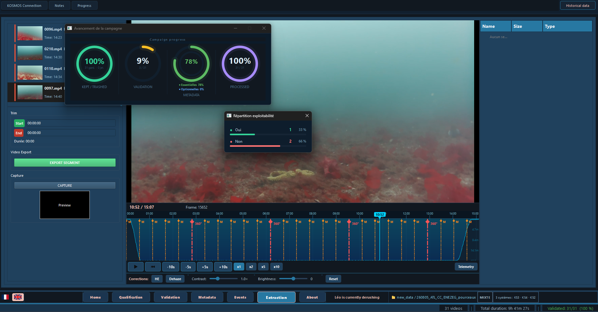

The progress dashboard gives a real-time overview of the campaign processing status. It shows how many videos have been qualified, validated, annotated and have their metadata filled in, so the operator can see at a glance what still needs to be done before generating the final PDF report.

---

## Features

| Page | Description |
|---|---|
| **Qualification** | Review all recordings on an interactive GPS map. Keep or discard each video with one click. |
| **Validation** | Secondary review pass. Toggle exploitability and stereo/mono status per video. |
| **Event annotation** | Mark timestamped events on the video timeline: fish, birds, turtles, motor events — with audio cues. |
| **Metadata editing** | Edit structured fields driven by a configurable `template.json` schema. Includes weather lookup and GPS map view. |
| **Extraction** | Clip video segments and capture still frames with CLAHE dehazing, histogram equalisation and stereo rectification. |
| **PDF report** | Generate a campaign report with statistics, GPS scatter, and per-video data sheets. |
| **SFTP transfer** | Pull files from the KOSMOS SD card directly over SSH/SFTP without mounting the drive. |
| **Bilingual UI** | French / English toggle at runtime. |

---

## Requirements

- **OS:** Windows 10 / 11
- **Python:** 3.12

| Package | Version | Role |
|---|---|---|
| `PyQt6` | 6.11.0 | GUI framework |
| `PyQt6-WebEngine` | 6.11.0 | Embedded Chromium for Leaflet maps |
| `opencv-python` | 4.13.0 | Video reading, frame extraction, stereo rectification |
| `numpy` | 2.4.4 | Vectorised image processing |
| `matplotlib` | 3.10.9 | PDF report generation |
| `pandas` | 3.0.2 | Telemetry CSV reading |
| `paramiko` | 4.0.0 | SFTP transfer from KOSMOS hardware |
| `requests` | 2.33.1 | Weather API (Open-Meteo) |
| `folium` | 0.20.0 | Interactive Leaflet map generation |
| `openpyxl` | — | Excel export |
| `pywin32` | 312 | Windows shell integration |

---

## Installation

### Option A — Conda (recommended)

```bash
conda env create -f environment.yml
conda activate kosmos-ihm
```

### Option B — pip / venv

```bash
python -m venv venv
venv\Scripts\activate
pip install -r requirements.txt
```

> **Note:** The map views require `PyQt6-WebEngine`. Make sure it is installed alongside `PyQt6`.

---

## Running

```bash
python main.py
```

On first launch, click **Open Campaign** and select:

1. **Raw footage directory** — folder containing the `.mp4` files from the KOSMOS device.
2. **Campaign output directory** — where processed results and sidecar JSON files will be written.
3. **Working directory** — temporary workspace used by the extraction pipeline.

Crash logs are written to `kosmos_crash.log` next to `main.py`.

---

## Build a standalone executable

A PyInstaller spec is provided to bundle the application into a self-contained Windows folder:

```bash
py -m PyInstaller KOSMOS_IHM.spec
```

Output: `dist\KOSMOS_IHM\KOSMOS_IHM.exe` — ships with Qt WebEngine, OpenCV, and all data files. No Python installation required on the target machine.

---

## Architecture

```
KOSMOS-IHM/
├── main.py                   # Entry point
├── ihm2.ui                   # Qt Designer layout (loaded at runtime)
├── template.json             # Metadata schema (drives the Metadata editor)
├── requirements.txt
├── environment.yml           # Conda environment spec (Python 3.12)
├── KOSMOS_IHM.spec           # PyInstaller build spec
│
├── controllers/              # Business logic, one controller per page
│   ├── app_controller.py     # Top-level orchestrator
│   ├── accueil_controller.py
│   ├── qualif_controller.py
│   ├── validation_controller.py
│   ├── evenements_controller.py
│   ├── metadonnees_controller.py
│   ├── extraction_controller.py
│   └── apropos_controller.py
│
├── models/                   # Qt item models (no widgets)
├── views/                    # Page widgets, dialogs, reusable widgets
├── services/                 # Backend I/O (SFTP, thumbnails, PDF, weather…)
├── assets/                   # Leaflet HTML/JS, WAV sound cues
└── img/                      # Application icons
```

---

## Data architecture

### Input data

The IHM consumes the raw output of a KOSMOS deployment. A typical campaign folder looks like:

```
campaign_raw/
├── VID_20240615_143012.mp4       # Raw video file
├── VID_20240615_143012.json      # Device metadata (read-only)
├── VID_20240615_143012.csv       # GPS / telemetry timeseries (read-only)
├── VID_20240615_150445.mp4
├── VID_20240615_150445.json
├── VID_20240615_150445.csv
└── ...
```

| File | Source | Description |
|---|---|---|
| `<stem>.mp4` | KOSMOS device | Raw video footage. Never modified. |
| `<stem>.json` | KOSMOS device | Device metadata: camera model, firmware version, system config. **Read-only** — the IHM never writes to these files. |
| `<stem>.csv` | KOSMOS device | Time-series telemetry: GPS coordinates, depth, heading, motor rotations. Read-only. |

### Output data

For each video the IHM creates and maintains a `_temp.json` sidecar file in the working directory. This is the **sole writable file** produced by the IHM.

```
working_dir/
├── VID_20240615_143012_temp.json   # All operator annotations for this video
├── VID_20240615_150445_temp.json
├── 240615_infoStation.csv          # Campaign-level metadata export (InfoStation format)
├── events_export.csv               # Annotated biological events export
└── report_campaign.pdf             # PDF campaign report
```

The `_temp.json` structure mirrors `template.json` and contains:

```
{
  "survey":            { … }   // Campaign-level fields (zone, date, boat, crew)
  "video_observation": { … }   // Video-level fields (GPS, depth, visibility, time)
                                // + qualification status (keep/discard)
                                // + exploitability and stereo/mono status
                                // + biological events (fish, birds, turtles…)
                                // + extraction deliverables (segments, frames)
}
```

| Output file | Format | Generated by |
|---|---|---|
| `<stem>_temp.json` | JSON | Created on campaign open, updated on every operator action |
| `YYMMDD_infoStation.csv` | CSV | Metadata export — one row per video, InfoStation column format |
| `events_export.csv` | CSV | Biological events — timecodes, types, values, comments |
| `report_campaign.pdf` | PDF | Campaign report with stats, GPS scatter and per-video sheets |
| Extracted frames / segments | JPG / MP4 | Produced by the Extraction page |
| Image batch (`lot d'images`) | JPG | Set of still frames extracted at marked positions, with optional image enhancement (CLAHE, colour correction, stereo rectification) |
| Video shortcut (`raccourci vidéo`) | MP4 | Trimmed video clip between the in/out markers set on the Extraction page |
| `BenthOS_sorties/` | folder | Main deliverable folder generated from the Metadata page. One sub-folder per video, named `YYYYMMDDhhmm_ZONE_StationCode/`, containing: the renamed `_temp.json`, an `IMG/` folder (receives the extracted frames), an `Annotation_VIAME.csv` stub ready to receive event annotations, and a Windows shortcut (`.lnk`) pointing back to the raw video file. |

---

## Keyboard shortcuts

| Shortcut | Page | Action |
|---|---|---|
| `Ctrl+Z` | Qualification | Undo last Keep / Discard |
| `Ctrl+Z` | Validation | Undo last exploitability change |
| `Ctrl+Z` | Events | Undo last event placement, deletion, or move |
| `Ctrl+drag` | Events — timeline | Move an event to a new position |
| `Space` | Video player | Play / Pause |
| `Delete` | Events — tree | Delete selected event |

---

## Authors

Developed at **IMT Atlantique** — Léo Bultel
